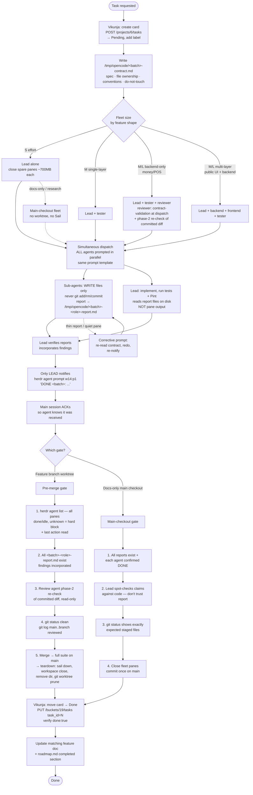

# Parallel Agent Workflow — Coffee Shop

Visualization of the herdr fleet orchestration: Vikunja tracking, contract-first
dispatch, parallel agents, report verification, gates, and cleanup. The rules
behind this chart live in `AGENTS.md` (Workflow section) and
`.opencode/skills/herdr-parallel/SKILL.md` — when those change, update this chart.

## Legend

| Node | Meaning |
| --- | --- |
| Contract first | `contract.md` kills redundant research — every agent starts from the same context |
| Shape decides the fleet | S → lead alone; M single-layer → lead+tester; M/L backend-only (money/POS) → lead+tester+reviewer (frontend would idle — only Filament blades, backend-owned); M/L full-stack → lead+backend+frontend+tester |
| WRITE files only | Agents never touch git; concurrent `git add` on a shared index races and can corrupt it — the lead stages everything |
| Report files | `/tmp/opencode/<batch>-<role>-report.md` — fixed naming so "all reports exist" is a mechanical check; pane output scrolls out of reach |
| Only lead notifies | Prevents message storms when several agents finish at once |
| Two gates | Worktree fleets get the heavy pre-merge gate (idle panes, phase-2 review, suite); docs-only fleets get the lighter 4-step check |
| DONE is not evidence | The report file on disk + lead spot-check are the evidence, never the DONE message alone |
| Wait primitives | `pane wait-output --match` (shells/tests) and `agent prompt --wait` / `agent wait --until` (agents) replace sleep-polling — not turn-scoped, pair with the report-file check; always `--timeout` |
